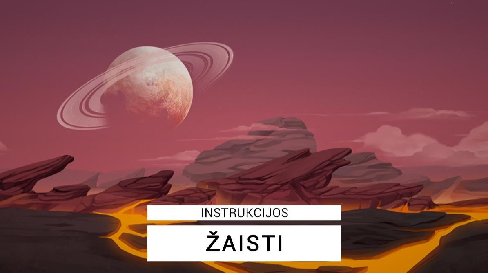
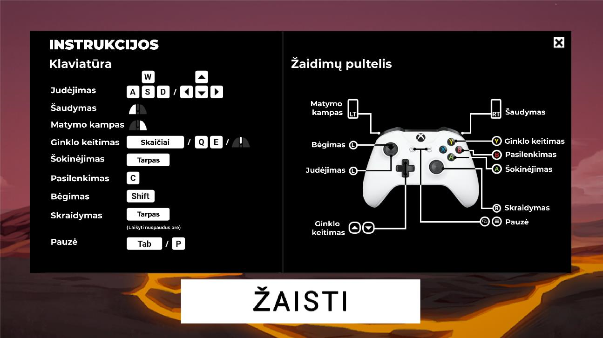
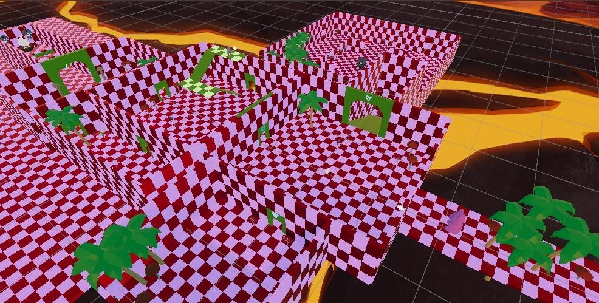
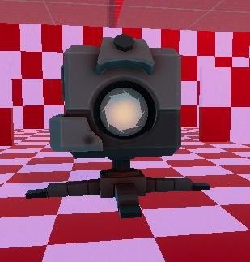
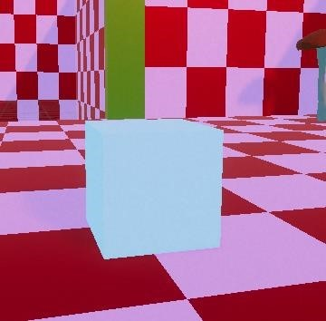
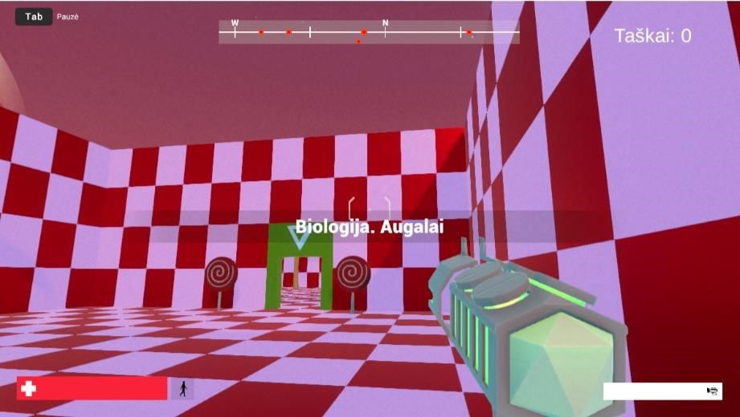
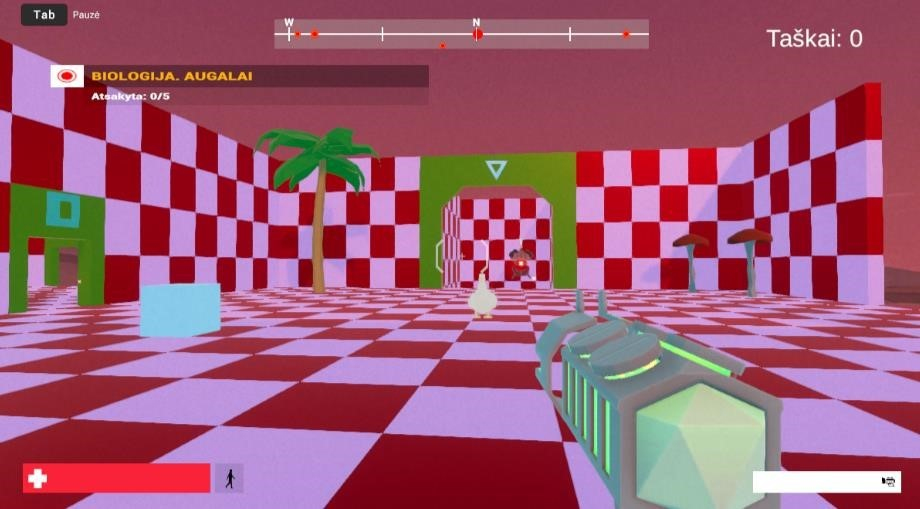
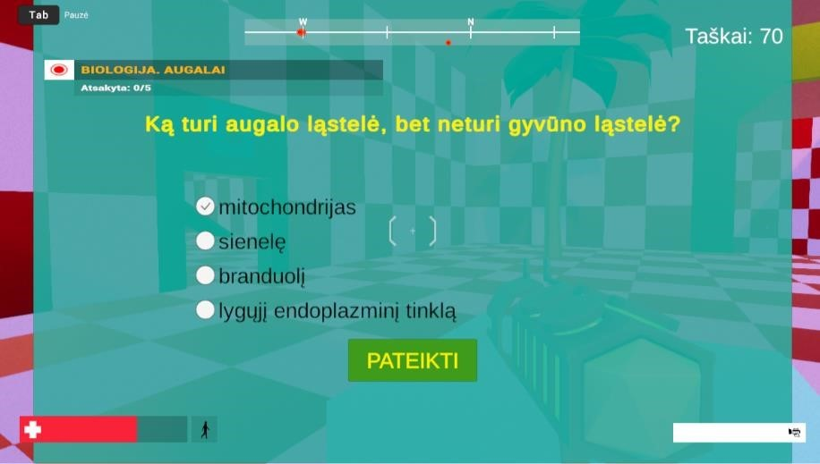
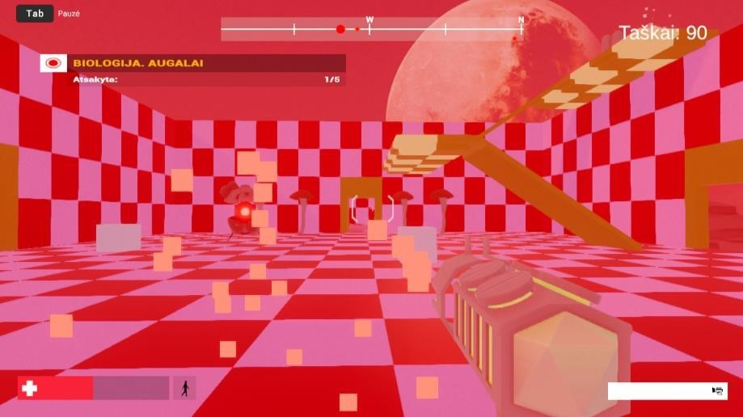

# Homework system game

For my Bachelor Degree project, I developed a **website** and **3D game** to make **homework more engaging** for students. Teachers could assign tests via the website, which students would complete through the 3D game interface.

**Here you can find a game part.**

I used the **Unity** game engine and the **FPS Microgame** template to create a first-person 3D shooter. The player explores a labyrinth-like map, battles enemy robots, and searches for **cubes containing questions** from homework assignments. Points are earned both for **defeating enemies** and for **correctly answering** questions. The game ends when **all enemies** are eliminated.

- **Backend repository** can be found here: https://github.com/agnerau/goose-backend
- **Frontend repository** can be found here: https://github.com/agnerau/goose-frontend

## Technologies Used

- **Game engine:** Unity
- **Game template** FPS Microgame
- **Adaptation to web:** WebGL

## Usage

To run the development server locally (http://localhost:8080/):

```bash
python3 server.py
```

## Visuals

### Start screen



### Controls



### Map



### Robot boss



### Question cube



### Start scene



### Goose in a game



### Question



### Battle with enemies



### Game end


